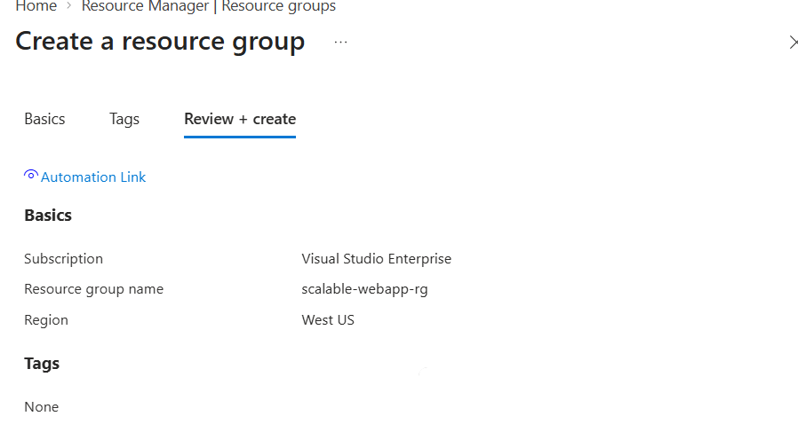
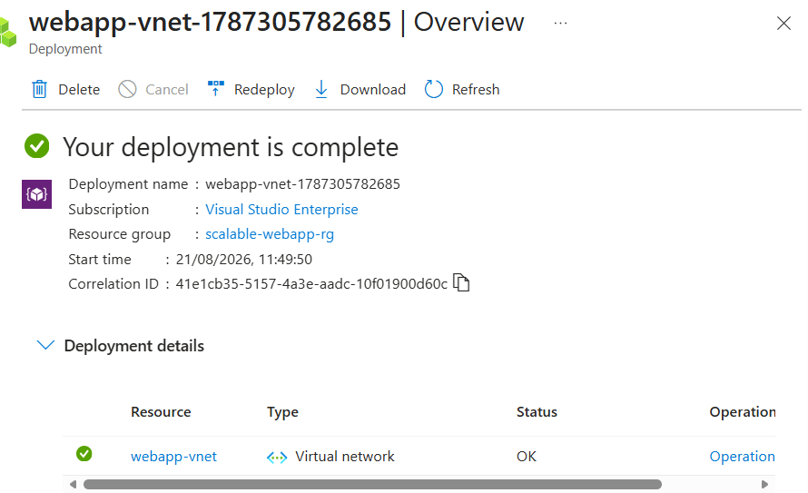
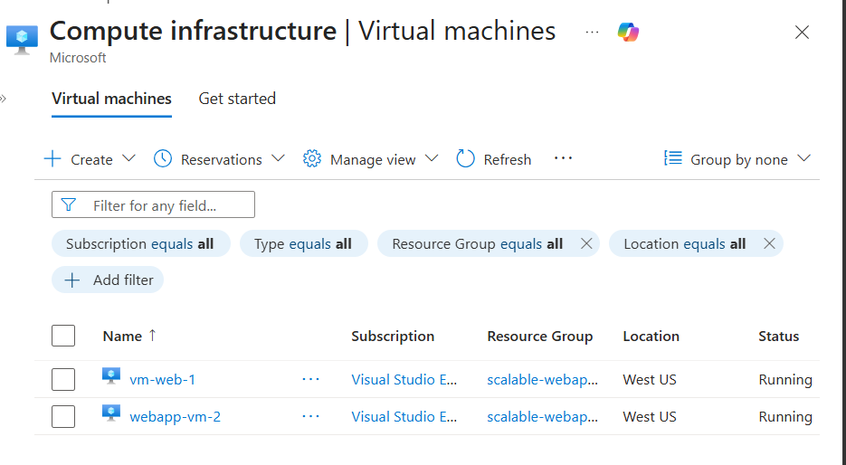
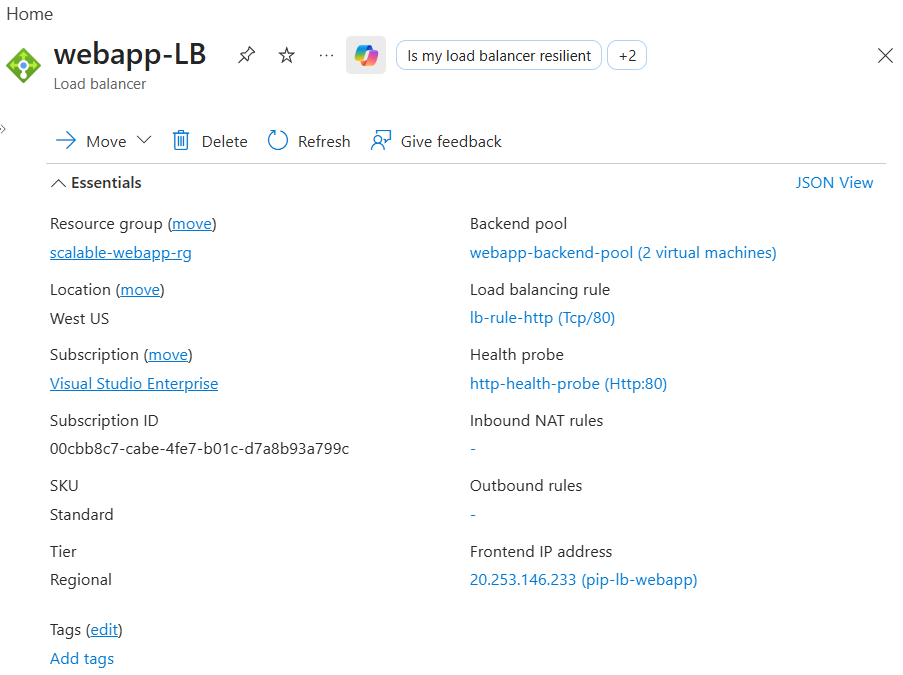
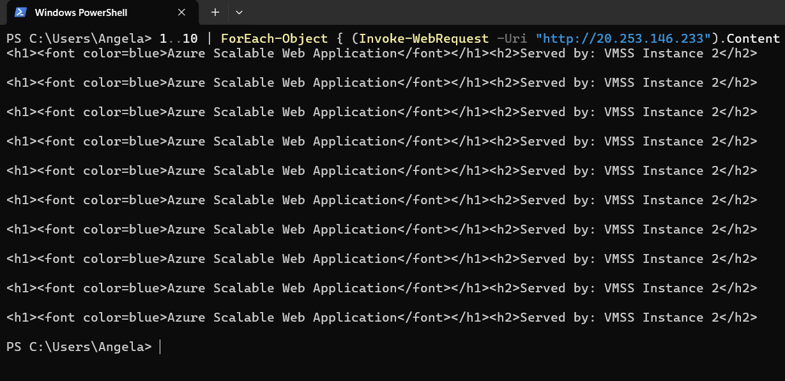

# Azure Load Balancer with Multiple Virtual Machines

## What this is
I built this as a hands-on lab to get comfortable with how load balancing 
actually works in Azure - not just the theory, but setting it up myself 
and proving it works. It uses two virtual machines sitting behind an 
Azure Load Balancer, so if one VM goes down or gets too busy, traffic 
just keeps flowing to the other.

## What I used
| Service                  | What it did for this project          |
|---------------------------|----------------------------------------|
| Resource Group            | Kept everything organised in one place |
| Virtual Network            | Let the VMs talk to each other and the outside world |
| 2x Virtual Machines       | The actual servers handling requests    |
| Azure Load Balancer       | Split incoming traffic between the two VMs |

## How it's put together

**Resource Group**
Everything for this project lives in one resource group, so it's easy 
to manage and just as easy to tear down when I'm done.



**Virtual Network**
Set up a VNet so the two VMs could sit on the same network and communicate.



**Virtual Machines**
Two VMs deployed as the backend - each one able to independently serve 
traffic if the other has an issue.



**Load Balancer**
This is the piece that ties it all together - a public IP as the entry 
point, both VMs added to the backend pool, a health probe checking they're 
actually up, and a rule routing traffic to whichever VM is healthy.



## Did it actually work?
Yes — I tested it with a PowerShell loop that hit the load balancer's 
public IP ten times in a row:

```powershell
1..10 | ForEach-Object { (Invoke-WebRequest -Uri "<public-ip>").Content }
```

Every single request came back successfully, which confirmed the load 
balancer was routing traffic correctly to a healthy backend.



## What I took away from this
This was my first time setting up load balancing from scratch, and it 
made a lot of the theory click - things like health probes, backend 
pools, and why having more than one instance actually matters in a real 
production setup.

## Full write-up
More detail is in the [`documentation`](./documentation) folder if you 
want the deeper technical breakdown.
